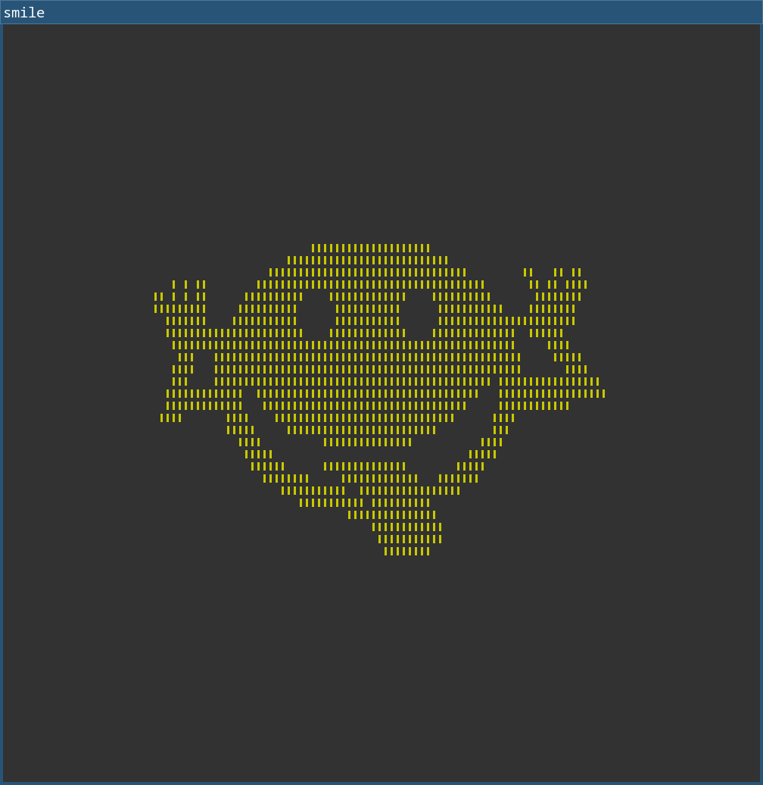

# XCB playground

Playground to familiarize myself with the [X Window System](https://xorg.freedesktop.org/archive/current/doc/index.html) in general and [XCB](https://xcb.freedesktop.org/) in particular.

Configuring the properties of a window is very flexible by using a list of key-value pairs. The keys are called *atoms* and are simple integer IDs represented as `uint32_t`. Given the name of an atom like `WM_NAME` (representing a window's title), the corresponding ID can be requested using `xcb_intern_atom()`. Once you have the ID, the value associated with the atom can be changed using `xcb_change_property()`.

The X protocol itself only defines a couple of atoms. (Actually, it only defines their IDs, but not their semantics.) More are defined by separate specifications:
- ICCCM (Inter-Client Communication Conventions Manual)
  - Atoms: `WM_NAME`, ...
  - XCB utility functions: `xcb/xcb_icccm.h`
  - Spec: https://xorg.freedesktop.org/archive/X11R7.7/doc/xorg-docs/icccm/icccm.html
- EWMH (Extended Window Manager Hints)
  - Spec: https://specifications.freedesktop.org/wm/latest/
  - XCB utility functions: `xcb/xcb_ewmh.h`
- And then there are those atoms that were introduced by someone in ancient times and that remain supported because no one proposed an alternative that caught on
  - `_MOTIF_WM_HINTS`
    - Allows various customizations, but the main thing seems to be hiding the title bar (which,
      it seems, neither ICCCM nor EWMH supports)
    - Every mention of this atom complains that there is no documentation for it
      - https://stackoverflow.com/questions/13787553/detect-if-a-x11-window-has-decorations
      - Gnome Metacity: `xprops.h` (https://github.com/GNOME/metacity/blob/master/src/include/xprops.h)
      - Patch for i3: https://cr.i3wm.org/patch/379/

You can use the `xprop` utility to query the atoms of a window by clicking on it.

Unfortunately, it seems you cannot affect the stacking order of a window when using i3wm:
- `_NET_WM_STATE_{ABOVE|BELOW}`: is ignored (<https://github.com/i3/i3/issues/4265>)
- `XCB_CONFIG_WINDOW_STACK_MODE`: dito
